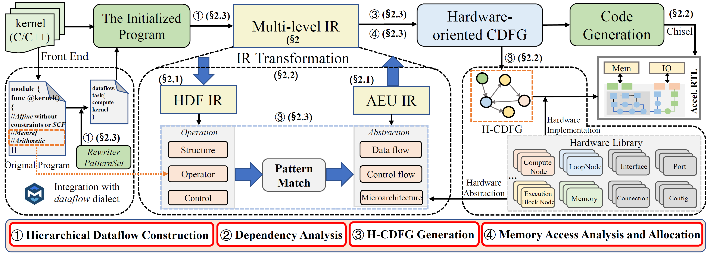
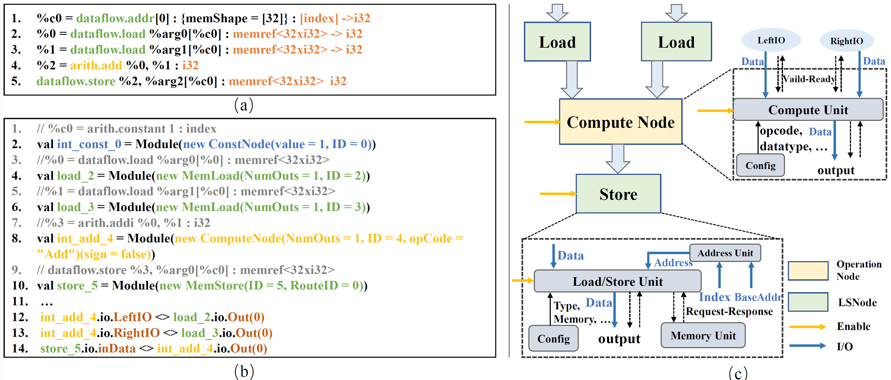
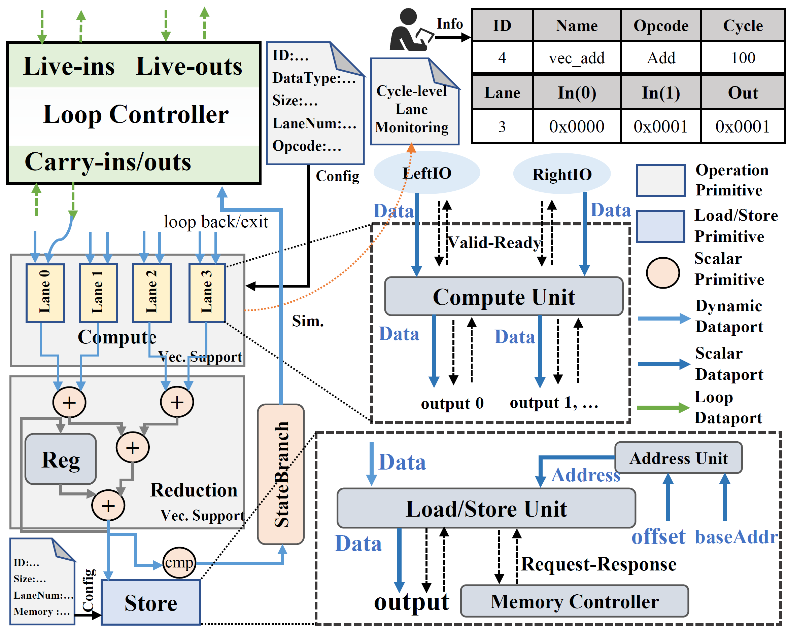

# DataFlowGen: An MLIR-based Framework for Efficient Dataflow Accelerator Generation

DataFlowGen is a scalable framework built on multi-level intermediate representation (MLIR) for efficient dataflow accelerator generation. DataFlowGen explicitly introduces a two-level IR to perform operations at suitable abstraction levels, capturing dataflow characteristics and multi-level hierarchy.
Leveraging these representations, we develop an automated optimizer that outlines the application kernel and performs dataflow transformations to derive a hardware-oriented control dataflow graph (H-CDFG). It enables concise representation and resource efficiency of hardware architectures.

## Overview

DataFlowGen lowers C/C++ kernels through MLIR, constructs dataflow-oriented IR, applies graph and memory optimizations, and emits Chisel-based accelerator components.



The repository includes three major parts:

- MLIR dialects and transformation passes for dataflow generation and optimization.
- A graph-based H-CDFG construction flow for memory scheduling, branch handling, and hardware-oriented lowering.
- A Chisel hardware library and generated accelerator modules under [`hardware/`](hardware/).

## Primitive

<table border="0">
  <tr>
    <td width="50%">
      
      <p align="center"><b>Figure 1:</b> IR-to-Architecture Mapping</p>
    </td>
    <td width="50%">
      
      <p align="center"><b>Figure 2:</b> Dataflow-Vector Primitives</p>
    </td>
  </tr>
</table>

These figures illustrate how DataFlowGen maps high-level IR operations to hardware modules and summarize the **Dataflow-Vector primitives** (vector lanes, compute nodes, and memory metadata) used for graph optimization.

## Setup

### Prerequisites
- python3
- cmake
- ninja
- clang and lld

### Clone DataFlowGen
```sh
$ git clone --recursive https://github.com/jiangnan7/DataFlowGen
$ cd DataFlowGen
```

### Build DataFlowGen
Run the following script to build DataFlowGen. You can pass `-j xx` to specify the number of parallel build jobs.
```sh
$ ./build_and_run.sh
```

Python bindings are optional. If you need them, install the Python dependencies and export the generated package path after the build:

```sh
$ python -m pip install -r requirements.txt
$ export PYTHONPATH=$(cd build && pwd)/python_packages/heteacc_core
```

### Build Hardware

Follow the instructions in [`hardware/README.md`](hardware/README.md) to install SBT and dependencies, enabling you to develop and run Chisel designs based on this library.

## Compiling C/C++

To translate a C/C++ kernel to MLIR, run:
```
$ ./thirdparty/Polygeist/build/bin/cgeist ./benchmark/HLS/if_loop_1/if_loop_1.cpp \
  -function=if_loop_1 -S -memref-fullrank \
  -raise-scf-to-affine > ./benchmark/HLS/if_loop_1/if_loop_1.mlir
```
## DataFlowGen-OPT

### IR Transformation
To generate and optimize the dataflow IR, run:
```
$  ./build/bin/heteacc-opt  ./benchmark/HLS/if_loop_1/if_loop_1.mlir   --generate-dataflow \
 --analyze-memref-address  --optimize-dataflow --cse  --enhanced-cdfg --memory-scheduling \
 --hybrid-branch-prediction --graph-init="top-func=if_loop_1" --debug-only="graph"
```

### Hardware Generation
This is a hardware library written in [Chisel](https://www.chisel-lang.org/). The core code is located in the hardware folder, which includes detailed hardware components and module implementations.

```
$ cd hardware
$ bash run.sh
```


## Publications

If you use DataFlowGen in your research, please cite the relevant paper, [DAC'26](https://www.dac.com/) and [ICCAD'25](https://ieeexplore.ieee.org/document/11240863)

```bibtex
@inproceedings{DataFlowGen_DAC,
  title     = {DataFlowGen: An MLIR-based Framework for Efficient Dataflow Accelerator Generation},
  author    = {Li, Jiangnan and Zhu, Kaixiang and Zhang, Zhengyi and Wang, Lingli},
  booktitle = {Proceedings of the 63rd ACM/IEEE Design Automation Conference (DAC)},
  year      = {2026},
  doi       = {10.1145/3770743.3803903}
}

@INPROCEEDINGS{DynVec_ICCAD,
  author={Li, Jiangnan and Cao, Xianfeng and Zhu, Kaixiang and Yin, Wenbo and Wang, Lingli},
  booktitle={2025 IEEE/ACM International Conference On Computer Aided Design (ICCAD)},
  title={DynVec: An End-to-End Framework for Efficient Vector-Dataflow Execution},
  year={2025},
  doi={10.1109/ICCAD66269.2025.11240863}
}
```
